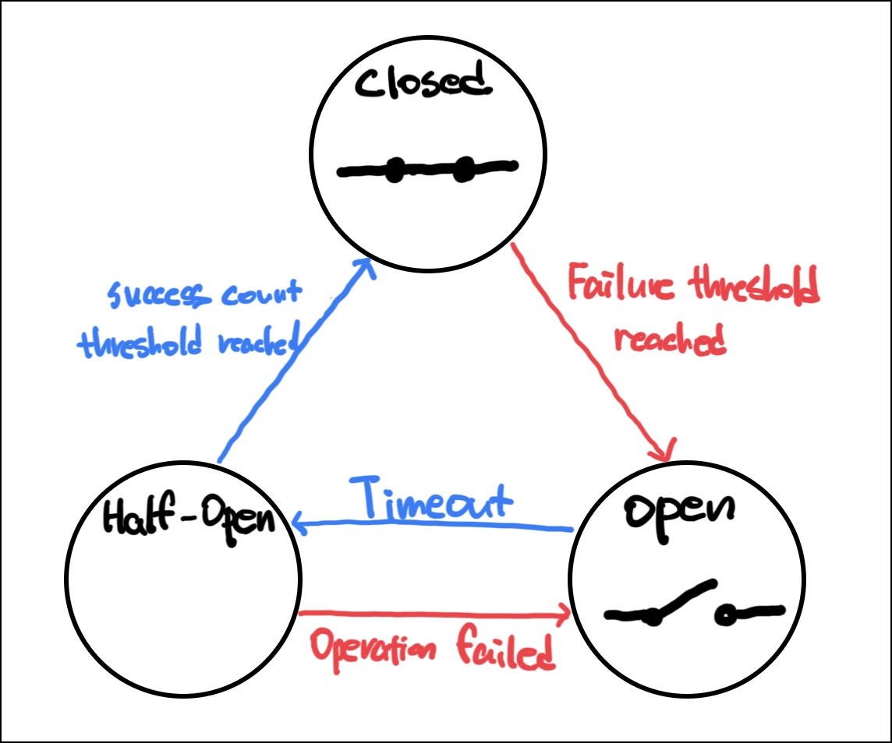

## Circuit Breaker?

Circuit Breaker(회로 차단기)란 전기 회로에서 과부하가 걸리지 않도록 자동으로 회로를 정지시키는 장치를 말합니다.
Software에서는 서비스의 장애나 과부하 상태가 다른 서비스로 전파되지 않도록 하는 패턴입니다.

Circuit Breaker는 3가지 상태를 가지고 있습니다.

1. `Closed`: 정상 상태로 모든 요청이 정상 처리됩니다. 일정 시간 내에 일정 수 이상의 요청이 실패하는 등 정해진 임계치에 도달하면 `Open` 상태가 됩니다.
2. `Open`: 비정상 상태로 모든 요청이 즉시 실패로 처리됩니다. 일정 시간이 지난 후 `Half Open` 상태가 됩니다.
3. `Half Open`: 일부 요청을 허용하여 정상 상태인지 판단합니다. 요청이 성공하면 `Closed` 상태가 되고, 실패하면 `Open` 상태가 됩니다.



## Golang Circuit Breaker 예제

```golang
package main

import (
    "errors"
    "fmt"
    "log/slog"
    "net/http"
    "time"

    "github.com/sony/gobreaker"
)

func main() {
    var cbSettings gobreaker.Settings
    cbSettings.Name = "HTTP GET"
    cbSettings.MaxRequests = 5
    cbSettings.Timeout = time.Duration(5 * time.Second)
    cbSettings.OnStateChange = func(name string, from, to gobreaker.State) {
        slog.Info(
            "state changed",
            slog.String("name", name),
            slog.String("from", from.String()),
            slog.String("to", to.String()),
        )
    }
    cb := gobreaker.NewCircuitBreaker(cbSettings)

    http.HandleFunc("/", func(w http.ResponseWriter, r *http.Request) {
        _, err := cb.Execute(func() (any, error) {
            return callInternalService()
        })
        if err != nil {
            http.Error(w, "Service unavailable", http.StatusServiceUnavailable)
        }
    })

    fmt.Println("Starting server on :8080")
    if err := http.ListenAndServe(":8080", nil); err != nil {
        fmt.Println("Error starting server:", err)
    }
}

func callInternalService() (any, error) {
    slog.Error("Internal service error")
    return nil, errors.New("Service Busy")
}
```

```bash
❯ go run main.go
Starting server on :8080
2025/01/11 07:52:02 ERROR Internal service error
2025/01/11 07:52:03 ERROR Internal service error
2025/01/11 07:52:03 ERROR Internal service error
2025/01/11 07:52:04 ERROR Internal service error
2025/01/11 07:52:04 ERROR Internal service error
2025/01/11 07:52:05 ERROR Internal service error
2025/01/11 07:52:05 INFO state changed from=closed to=open
2025/01/11 07:52:20 INFO state changed from=open to=half-open
2025/01/11 07:52:20 ERROR Internal service error
2025/01/11 07:52:20 INFO state changed from=half-open to=open
```

## 참고

- [Circuit Breaker Pattern](<https://learn.microsoft.com/en-us/previous-versions/msp-n-p/dn589784(v=pandp.10)?redirectedfrom=MSDN>)
- [sony/gobreaker](https://github.com/sony/gobreaker?tab=readme-ov-file)
