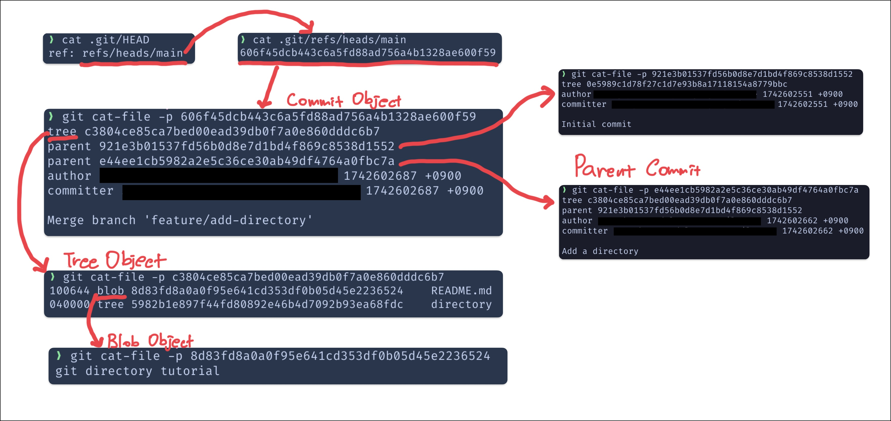

## Git이란?

Git은 **분산 버전 관리 시스템(DVCS)** 입니다. 로컬 저장소와 원격 저장소를 구분하며, 로컬 저장소 하나만으로도 모든 버전 정보가 보존되기 때문에 인터넷 없이도 브랜치 이동, 로그 확인, 커밋 등의 작업이 가능합니다.

Git은 내부적으로 스냅샷(Snapshot) 기반으로 파일을 관리합니다. 즉, 변경된 파일만 저장하는 것이 아니라 전체 파일 트리를 저장해두는 구조입니다. 이 모든 정보는 .git 디렉터리에 저장되며, 우리가 사용하는 대부분의 Git 명령어는 이 디렉터리를 조작하는 것입니다.

---

## .git/objects: Git의 핵심 저장소

.git/objects 디렉터리는 Git이 모든 데이터를 저장하는 공간입니다. Git은 데이터를 object 단위로 저장하며, 총 4가지 종류의 object가 존재합니다:

- blob: 파일의 내용 자체
- tree: 디렉터리와 그 안의 파일 목록
- commit: 커밋 정보
- tag: 태그 정보

각 object는 해당 내용을 압축(zlib)한 뒤 SHA-1 해시값을 기반으로 파일로 저장됩니다.

예를 들어, e69de29bb2d1d6434b8b29ae775ad8c2e48c5391이라는 object는 다음 경로에 저장됩니다:

```txt
.git/objects/e6/9d...5391
```

---

### Object 내부 구조

📄 blob

- 파일의 실제 내용
- 압축 해제 시 구조: blob <크기>\0<내용>

```sh
echo "Hello, Git" | git hash-object --stdin -w
git cat-file -p <해시값>
```

---

📁 tree

- 디렉터리의 스냅샷
- 파일 이름, 권한, 해당 blob의 해시 등을 포함

```sh
git cat-file -p <tree 해시>
```

예시 출력:

```txt
100644 blob e69de29bb2d1d6434b8b29ae775ad8c2e48c5391 hello.txt
```

---

📝 commit

- 커밋의 메타데이터와 메시지
- 부모 커밋, 작성자, 커밋 시각 등을 포함

```sh
git cat-file -p <commit 해시>
```

예시 출력:

```txt
tree 4b825dc642cb6eb9a060e54bf8d69288fbee4904
author John Doe <john@example.com> 1617911801 +0900
committer John Doe <john@example.com> 1617911801 +0900

초기 커밋 (parent 없음)
```

```txt
tree 4b825dc642cb6eb9a060e54bf8d69288fbee4904
parent 1a2b3c4d5e6f7890123456789abcdef123456789
author John Doe <john@example.com> 1617912801 +0900
committer John Doe <john@example.com> 1617912801 +0900

Add Login feature
일반 커밋 (parent 하나)
```

```txt
tree 6c5b9a67823456789abcdef0123456789abcdef0
parent 1a2b3c4d5e6f7890123456789abcdef123456789
parent 9f8e7d6c5b4a3210987654321fedcba987654321
author John Doe <john@example.com> 1617913801 +0900
committer John Doe <john@example.com> 1617913801 +0900

Merge branch 'feature/login'
머지 커밋 (parent 2개)
```

---

🏷️ tag

- 주로 release 버전 같은 특정 커밋에 이름을 붙이는 데 사용
- annotated tag의 경우 tag object가 별도로 생성됨

```sh
git cat-file -p <tag 해시>
```

---

## .git/HEAD와 refs 디렉터리

Git에서 현재 어디를 가리키고 있는지를 파악하려면 .git/HEAD와 refs 디렉터리를 살펴봐야 합니다.

---

### .git/HEAD 파일

- 현재 체크아웃된 브랜치를 나타냅니다.
- 보통 다음과 같은 형식으로 되어 있습니다:

```txt
ref: refs/heads/main
```

- detached HEAD 상태일 경우, 커밋 해시가 직접 들어갑니다:

```txt
e3a1b2c3d4e5f67890123456789abcdef12345678
```

---

### .git/refs 디렉터리

- refs/heads/: 로컬 브랜치 정보
- refs/tags/: 태그 정보
- refs/remotes/: 원격 브랜치 정보

각 파일에는 해당 브랜치나 태그가 가리키는 커밋의 SHA-1 해시가 저장되어 있습니다.

```sh
cat .git/refs/heads/main
```

출력 예시:

```txt
e3a1b2c3d4e5f67890123456789abcdef12345678
```

---

## HEAD → refs → objects: 연결 관계

Git은 아래와 같은 구조로 커밋과 파일을 추적합니다:

HEAD → refs/heads/main → commit object → tree object → blob object

각 단계의 의미는 다음과 같습니다:

구성 요소 설명

- HEAD 현재 체크아웃된 브랜치 정보
- refs/heads/\* 브랜치가 가리키는 커밋 해시
- commit 커밋 정보, 부모 커밋, tree 해시
- tree 폴더 구조, 파일 목록 및 blob 연결
- blob 실제 파일의 내용

---

🔗 예시 흐름



이와 같은 객체 간 연결을 통해 Git은 브랜치, 커밋, 파일을 추적하고, 효율적으로 복원할 수 있게 됩니다.

---

## Git 내부 확인에 유용한 명령어

```sh
# 현재 브랜치 이름 확인
git symbolic-ref --short HEAD
# HEAD가 가리키는 커밋 해시 확인
git rev-parse HEAD
# 특정 object의 타입 확인
git cat-file -t <해시값>
# object의 실제 내용 확인
git cat-file -p <해시값>
# 파일을 object로 저장
git hash-object -w <파일경로>
```
