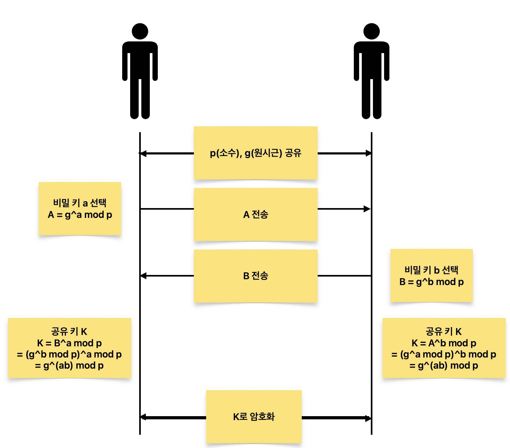

## 개요

디피-헬만 키 교환 알고리즘(Diffie-Hellman Key Exchange, DH)은 1976년 Whitfield Diffie와 Martin Hellman이 발표한 암호학 프로토콜로, **공개된 네트워크 환경에서 비밀 키를 안전하게 공유할 수 있는 방법**을 제시합니다.

## 원리

디피-헬만 알고리즘은 **이산 로그 문제(Discrete Logarithm Problem)** 의 어려움을 기반으로 합니다.. 수학적으로는 다음과 같은 절차로 동작합니다..

- 두 참여자는 큰 소수 $p$와 원시근 $g$를 공유한다.
- 각자 비밀 키 $a, b$를 선택한다.
- 각자의 공개 키를 계산한다:
  - $A = g^a \bmod p$
  - $B = g^b \bmod p$
- 공유 키 계산:
  - Alice: $K = B^a \bmod p$
  - Bob: $K = A^b \bmod p$
  - 결국 $K = g^{ab} \bmod p$

이 과정을 통해 제3자는 공유 키를 알 수 없으며, 두 참여자만 동일한 세션 키를 계산할 수 있게 됩니다.

## 동작 예제

예시로 간단한 수를 사용해 보면:

- 공개 값:  
  $p = 23$, $g = 5$

- Alice의 비밀 키: $a = 6$

  - $A = 5^6 \bmod 23 = 8$

- Bob의 비밀 키: $b = 15$

  - $B = 5^{15} \bmod 23 = 2$

- 공유 키:

  - Alice: $2^6 \bmod 23 = 18$
  - Bob: $8^{15} \bmod 23 = 18$

즉, 공개된 값만으로는 알 수 없는 공유 키 `18`이 안전하게 생성됩니다.

## DHE (Diffie-Hellman Ephemeral)

DHE는 디피-헬만 알고리즘의 **임시(일회성) 버전**으로, 매 세션마다 새로운 비밀 키 쌍을 생성하여 **Perfect Forward Secrecy (PFS)** 를 보장합니다.

이를 통해 세션 키가 유출되더라도, **이전 통신의 내용을 복호화할 수 없습니다.**

## Perfect Forward Secrecy (PFS)

**Perfect Forward Secrecy**란, 보안 통신에서 **과거의 세션 키가 노출되더라도 해당 세션 외에는 영향을 주지 않는 특성** 을 의미합니다.

### 왜 중요한가?

- 기본적인 RSA 기반 키 교환은 서버의 개인 키가 유출되면 **모든 과거 통신을 복호화** 할 수 있습니다.
- PFS가 적용된 방식에서는 세션마다 새로운 키를 사용하므로, 과거 세션은 안전하게 보호됩니다.

### 구현 방법

- 매 세션마다 새로운 키 쌍을 생성 (Ephemeral)
- 대표 알고리즘: **DHE**, **ECDHE**

### 요약 표

| 항목                  | PFS 미지원       | PFS 지원           |
| --------------------- | ---------------- | ------------------ |
| 키 재사용             | O (고정 키 사용) | X (세션마다 새 키) |
| 과거 세션 복호화 위험 | 있음             | 없음               |
| 알고리즘 예시         | RSA              | DHE, ECDHE         |

## 다른 알고리즘과의 비교

| 알고리즘  | 공개키 암호화 | 키 교환 | PFS 지원       | 특이사항                  |
| --------- | ------------- | ------- | -------------- | ------------------------- |
| **RSA**   | O             | O       | X (기본적으로) | 빠르지만 PFS 없음         |
| **DH**    | X             | O       | X (기본적으로) | 고정 키 사용              |
| **DHE**   | X             | O       | O              | 세션마다 임시 키 생성     |
| **ECDHE** | X             | O       | O              | 타원 곡선 기반, 성능 우수 |

> 참고: DHE와 ECDHE는 공개키 **기반** 알고리즘이지만, **공개키로 직접 암호화하지 않고 키 교환에만 사용**된다는 점에서 RSA와 구분됩니다.

## 마무리

디피-헬만 알고리즘은 암호화 통신에서 가장 오래되고 핵심적인 키 교환 방식입니다.
오늘날에는 DHE 또는 ECDHE와 같이 PFS를 보장하는 형태로 많이 사용되며, HTTPS, VPN, SSH 등의 다양한 보안 프로토콜의 기반이 됩니다.

## 참고자료

[https://en.wikipedia.org/wiki/Diffie–Hellman_key_exchange](https://en.wikipedia.org/wiki/Diffie–Hellman_key_exchange)
