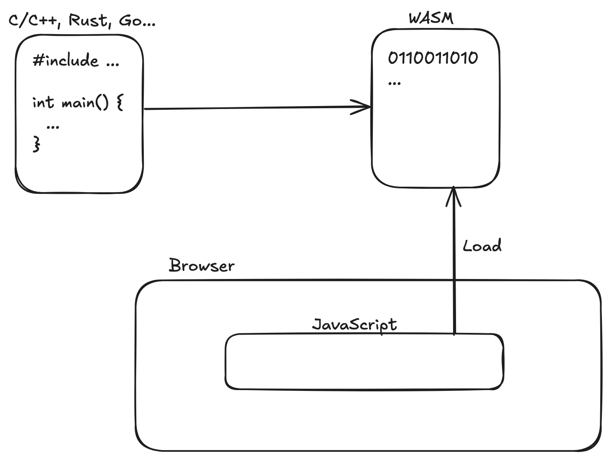

## WebAssembly란?

**WebAssembly(WASM)** 는 브라우저에서 실행 가능한 **바이너리 형식의 저수준 언어**입니다. 빠르고, 안전하고, 플랫폼 독립적인 실행 환경을 제공해. 브라우저가 마치 “가상 머신”처럼 동작하게 만들어서 C, C++, Rust 같은 언어로 작성된 고성능 코드를 **웹에서 직접 실행**할 수 있게 합니다.

### **주요 특징**

- **빠름**: JS보다 빠르게 실행됨 (거의 네이티브에 가까운 속도)
- **안전함**: 샌드박스 환경에서 실행되므로 보안상 안전
- **다양한 언어 지원**: Rust, C/C++, AssemblyScript 등
- **브라우저 호환**: 모든 주요 브라우저에서 지원 (Chrome, Firefox, Safari 등)

### **WASM의 장단점**

장점

- **고성능 연산**: 이미지 처리, 암호화, 게임 로직 등에 유리
- **다른 언어 재사용**: 기존 C/C++/Rust 라이브러리를 그대로 사용 가능
- **JavaScript와 연동 가능**: JS ↔ WASM 양방향 호출 가능

단점

- **DOM 접근 불가**: 직접 HTML 요소를 다룰 수 없음 (JS 통해야 함)
- **디버깅 어려움**: 바이너리 포맷이기 때문에 디버깅이 어려움
- **초기 로딩 비용**: .wasm 파일을 네트워크로 받아야 함

## WebAssembly 동작 방식



```text
[Rust Source Code]
       ↓ (컴파일)
   [module.wasm]
       ↓
[Browser]
 ├─ WebAssembly VM → .wasm 실행
 └─ JavaScript Engine → JS와 연동
```

## Example - Rust로 SHA-256 해시 WebAssembly 모듈 만들기

Cargo.toml

```toml
[package]
name = "wasm_sha256"
version = "0.1.0"
edition = "2024"

[lib]
crate-type = ["cdylib"]

[dependencies]
sha2 = "0.10"
wasm-bindgen = "0.2"
hex = "0.4"
```

src/lib

```rust
use sha2::{Digest, Sha256};
use wasm_bindgen::prelude::*;

#[wasm_bindgen]
pub fn sha256_hash(input: &str) -> String {
    let mut hasher = Sha256::new();
    hasher.update(input);
    let result = hasher.finalize();
    hex::encode(result)
}
```

index.html

```html
<!DOCTYPE html>
<html lang="en">
  <head>
    <meta charset="UTF-8" />
    <title>WASM SHA256 Example</title>
  </head>
  <body>
    <h1>SHA256 Hasher (WASM + Rust)</h1>
    <input type="text" id="input" placeholder="Enter text" />
    <button id="hashBtn">Hash</button>
    <p>Hash: <span id="output"></span></p>

    <script type="module">
      import init, { sha256_hash } from './pkg/wasm_sha256.js';

      async function main() {
        await init(); // Initialize WASM

        document.getElementById('hashBtn').addEventListener('click', () => {
          const input = document.getElementById('input').value;
          const output = sha256_hash(input);
          document.getElementById('output').textContent = output;
        });
      }

      main();
    </script>
  </body>
</html>
```

wasm-pack 설치

```bash
cargo install wasm-pack
```

빌드

```bash
wasm-pack build --target web
```

## **WASI란?**

**WASI(WebAssembly System Interface)** 는 WebAssembly를 **서버나 CLI 환경에서 실행할 수 있게 만들어주는 인터페이스**입니다.

WASI의 역할

- 파일 시스템 접근
- 네트워크 통신
- 환경 변수 및 시간 정보 제공

즉, WASI는 WebAssembly가 **리눅스/유닉스 같은 환경에서 실행**될 수 있게 해줍니다. 이를 통해 Rust로 만든 WebAssembly 모듈을 서버에서도 실행할 수 있습니다.
